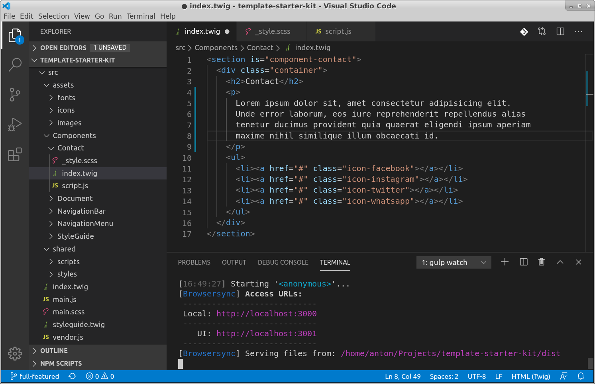

<!--

keywords:
template starter kit, html-template, template, boilerplate, template builder, component based template, twig template

-->

<div align="center">
    <h1>Template Starter Kit</h1>
    <p> Build html templates with component based setup.</p>
</div>



## Projects based on Template Starter Kit

| Project                                                                             | Result                                                                                 |
| ----------------------------------------------------------------------------------- | -------------------------------------------------------------------------------------- |
| <a href="https://github.com/frontant/delicious-sushi-template/">delicious sushi</a> | <a href="https://frontant.github.io/demo-sites/delicious-sushi-template/">showcase</a> |

## How to run the development environment

```bash
# prepare the environment
npm i

# run the development mode
npm run watch

# open 'http://localhost:3000' and start developing
```

## How to build

```bash
# build
npm run build
```

## Branches

- <b>essential</b>
  - basic setup
- <b>full-featured</b>
  - basic setup
  - frequently used mixins, polyfills, javascript
  - more components
- <b>master</b> (same as <i>"essential"</i> branch)
